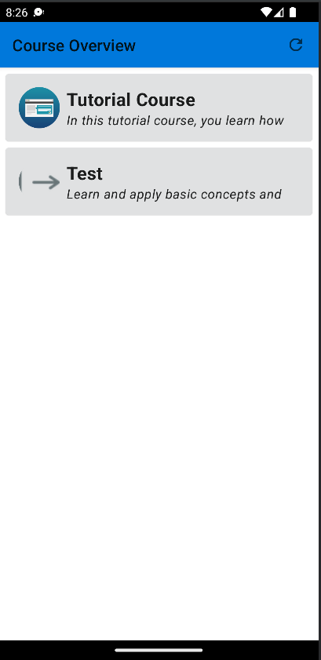
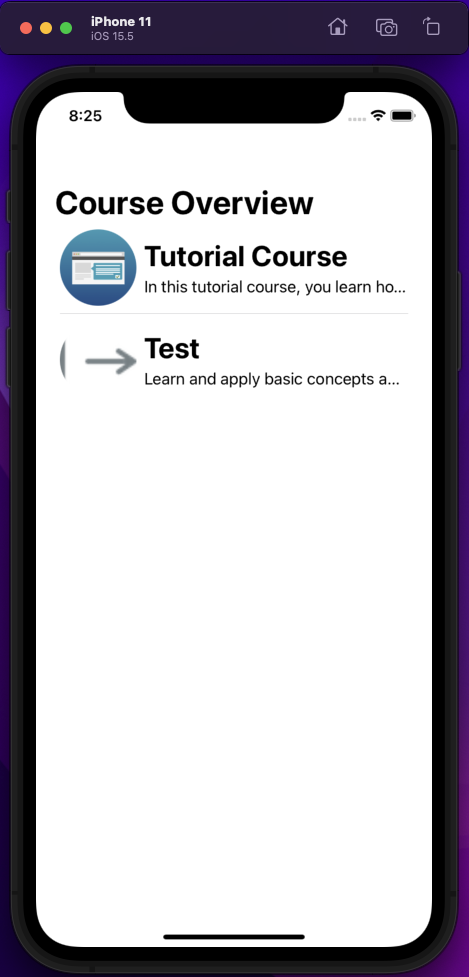
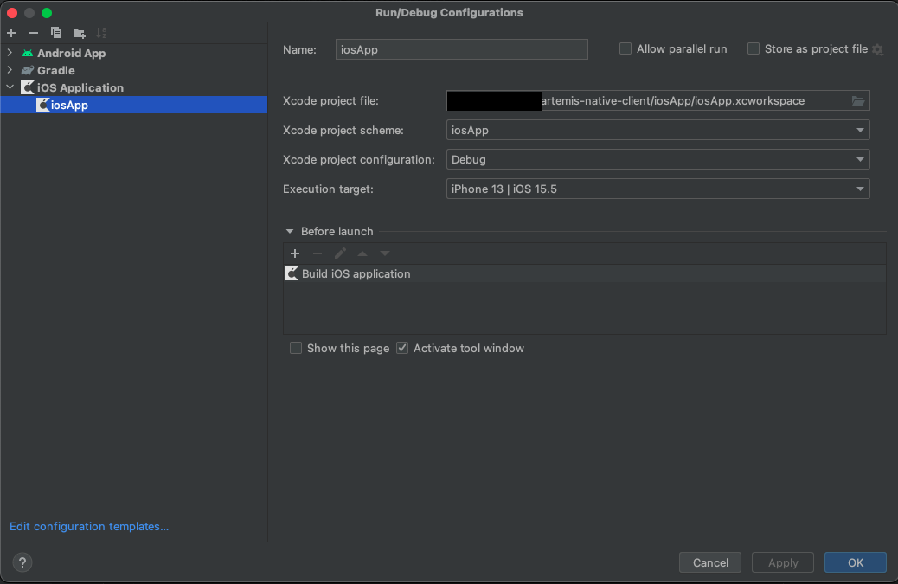

# Artemis Native Client (Android + iOS)

## How to open
Perform the steps in this order (first time only):
1. Clone the repository
2. Open the folder in Android Studio (Kotlin Multiplatform Mobile plugin installed)
3. Open the iosApp subfolder in Xcode
4. You can now start the Android and iOS apps. 

## Project structure
All logic that can be shared between the Android and iOS app is written in the **app common** gradle submodule. The code in **app common** can be access from both the Android submodule and the iOS folder. The project uses Kotlin Multiplatform Mobile.

### App Common
The following libraries are used:
1. *Ktor*: Official Kotlin HTTP Client by JetBrains.
2. *Kotlinx Serialization*: Deserialize and serialize Kotlin classes from and to JSON. Used to deserialize the JSON sent from the server.
3. *Koin*: Kotlin Dependency Injection Framework.
4. *Decompose*: Allows to share ViewModels and the navigation logic between Android and iOS.
5. *Kotlin Coroutines*: Built-in feature by Kotlin. Used to make asynchronous calls. Additionally, brings the Kotlin flows, which are used to build response UI that can immediately react to changes in the model.

### Android
The UI is written in Jetpack Compose. Kotlin is simply compiled to JVM bytecode.

### iOS
The UI is written in SwiftUI. The Kotlin code is compiled to a native binaries and then used like any ObjectiveC/Swift library.

## How to use
You can open the project using Android Studio with the Kotlin Multiplatform Mobile plugin installed to work on the common module and on the android module. In XCode/AppCode simply open the iosApp folder. Debugging of the Android App is possible by simply using breakpoints in Android Studio and attaching a debugger to the app. For iOS, you can debug the Kotlin Code by running the iOS app from Android Studio in debug mode, and simply setting breakpoints. 

### How to run the iOS app
The iOS app can either be launched from Xcode directly, or from Android Studio using the ios run configuration.

TO run the iOS App in Android Studio, the [Kotlin Multiplatform Mobile plugin](https://plugins.jetbrains.com/plugin/14936-kotlin-multiplatform-mobile) is required.

To start the app, select the run configuration iOS:

The exact configuration is the following:

