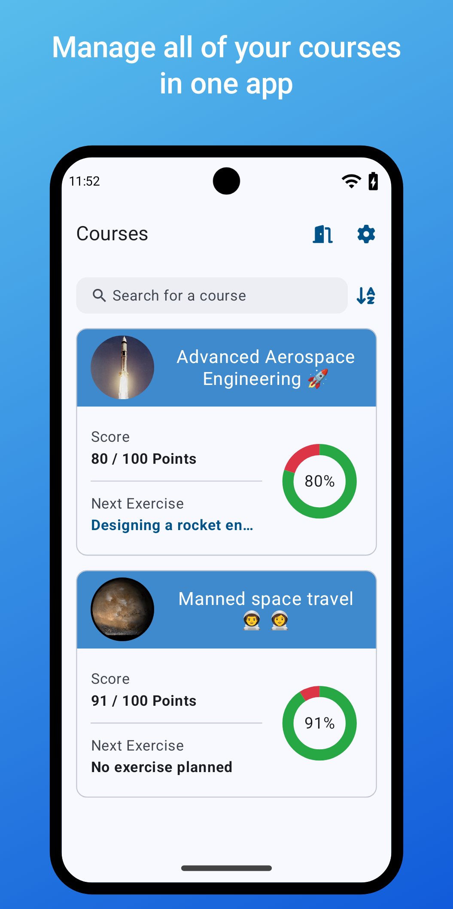
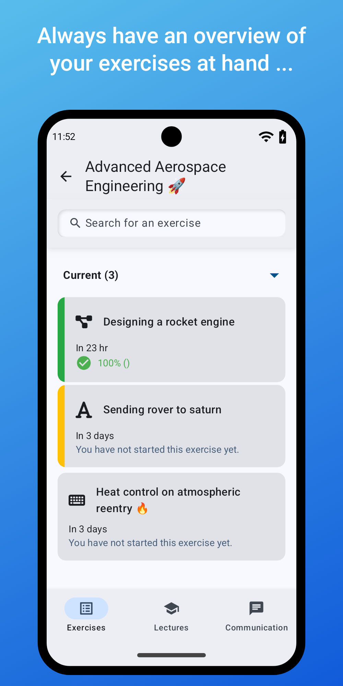
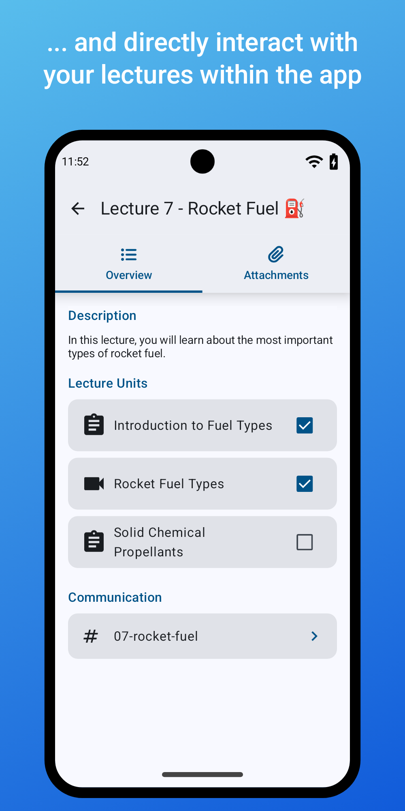
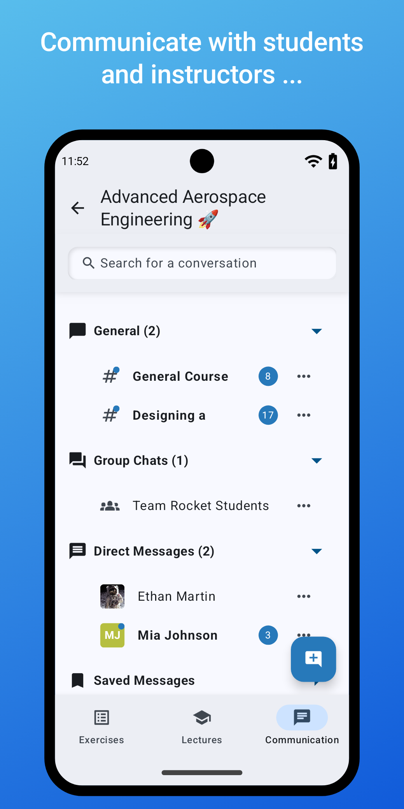

# Artemis Android
The native android client for Artemis, an interactive learning platform with individual feedback. 

## Screenshots

## Project structure
The project structure is heavily inspired by [nowinandroid](https://github.com/android/nowinandroid). 
The modularization is heavily borrowed from the [one described in nowinandroid](https://github.com/android/nowinandroid/blob/main/docs/ModularizationLearningJourney.md).
The modularization helps keeping the app maintainable, fastens up build times and allows it to easily scale with new features.

The modularization is split up into two parent modules:
- **core**: Shares common code between features and code not directly related to features.
  - common: Code used in every other module
  - data: Request and send data over the network
  - datastore: Permanently store data in the application, e.g. access tokens.
  - device: Provides information about the status of the device, e.g. network connectivity.
  - model: Represent the data sent by the server, e.g. exercises, lectures. Uses kotlinx serialization.
  - ui: Common ui needed by more than one feature module.
  - websocket: Receive updates from the server.
- **feature**: Submodules directly implementing features such as the dashboard.

The following libraries and tools are utilized:
- Jetpack Compose: UI
- Koin: Dependency Injection
- Kotlin Flows: Reactive programing
- AndroidX DataStore: Persistently store key-value pairs

## Development setup
To run this project, you need a recent version of [Android Studio](https://developer.android.com/studio) or IntelliJ (not guaranteed to work) and the AndroidSDK installed.
If you want to run the end-to-end tests, you will also need [docker](https://www.docker.com/). 

Alternative, you can install the Android SDK as described here: https://benshapi.ro/post/android-sdk-without-android-studio

## Build flavors
This project is configured to support multiple [flavor dimensions](https://developer.android.com/build/build-variants):
- TUM or unrestricted: For TUM builds, users are forced to connect to the [TUM Artemis instance](https://artemis.cit.tum.de).
- Beta or production: In beta builds, an extra label and dialog is displayed to signal that the build may contain bugs. 

## Tests
We use both unit tests and end-to-end integration tests. Before running the end-to-end tests, consider the licenses section in this readme.
- To run the unit tests, execute `./gradlew test -Dskip.unit-tests=false -Dskip.e2e=true -Dskip.debugVariants=true -Dskip.flavor.unrestricted=true -Dskip.flavor.beta=true`
- To run the end-to-end tests, execute `docker compose -f docker/e2e-tests.yml up artemis-android-e2e`

For AndroidStudio, there are also preconfigured run configurations available. 

## Play store screenshots
Screenshots can be generated using preview-composables in the `debug` source sets. They are annotated with `@PlayStoreScreenshots`. To get the screenshots, right click the rendered preview
in AndroidStudio and select copy-image.

## License
By building the dockerfile or using its derived images, you accept the terms in the following license agreements:
* [Android Software Development Kit License Agreement](https://raw.githubusercontent.com/thyrlian/AndroidSDK/master/EULA/AndroidSoftwareDevelopmentKitLicenseAgreement-20190116) (or read it [here](https://developer.android.com/studio/terms.html))
* [Android SDK Preview License Agreement](https://raw.githubusercontent.com/thyrlian/AndroidSDK/master/EULA/AndroidSDKPreviewLicenseAgreement)
* [Intel Android Extra License](https://raw.githubusercontent.com/thyrlian/AndroidSDK/master/EULA/IntelAndroidExtraLicense)
